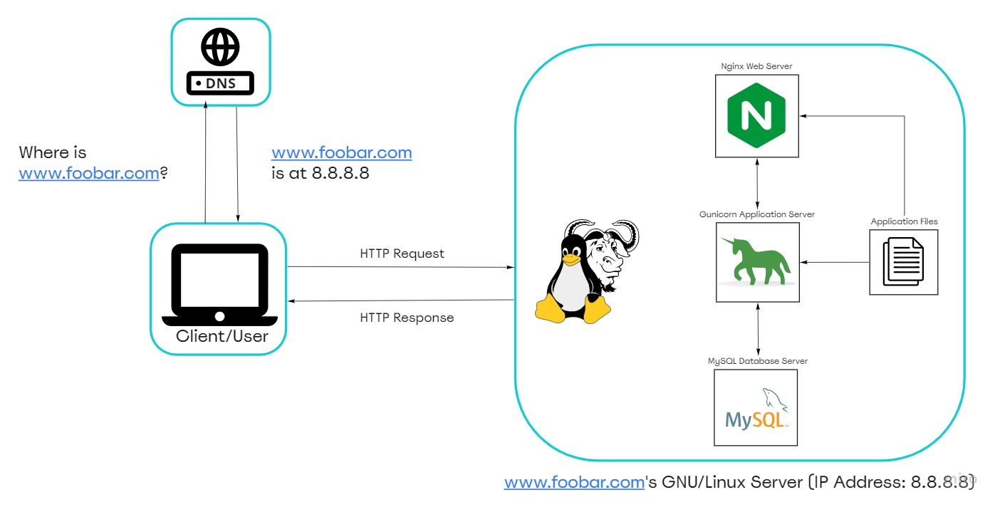

# Simple Web Stack

## Description

This is a simple web infrastructure that hosts a website that is reachable via `www.foobar.com`. There are no firewalls or SSL certificates for protecting the server's network security. Each component that is(database, application server) has to share the resources that is (CPU, RAM, and SSD) provided by the server.

## Specifics About This Infrastructure

+ What is a server? This is a computer hardware or software that provides functionalities for other programs or devices, called *clients*.

+ What is the role of the domain name? To provide a human-friendly alias for an IP Address. It maps a user friendly name to an IP Address of a server where the actual resource sits. For example, the domain name `www.wikipedia.org` is easier to recognize and remember than `91.198.174.192`. The IP address and domain name alias is mapped in the Domain Name System (DNS)

+ The type of DNS record `www`  in `www.foobar.com`. `www.foobar.com uses a CNAME record that points to foobar.com. foobar.com` uses an **A record**. This can be checked by running `dig www.foobar.com`. **Note:** the results might be different but for the infrastructure in this design, an **A** record is used. 
<i>Address Mapping record (A Record)—also known as a DNS host record, stores a hostname and its corresponding IPv4 address.</i>

+ The role of the web server. The web server is a software/hardware that accepts requests via HTTP or secure variant (HTTPS) and responds with the content of the requested resource or an error messsage.

+ The role of the application server. To install, operate and host applications and associated services for end users, IT services and organizations and facilitates the hosting and delivery of high-end consumer or business applications

+ The role of the database. To maintain a collection of organized information that can easily be accessed, managed and updated

+ What the server uses to communicate with the client (computer of the user requesting the website). Communication between the client and the server occurs over the internet network through the TCP/IP protocol suite.

## Issues With This Infrastructure

+ There are multiple SPOF (Single Point Of Failure) in this infrastructure. For example, if the MySQL database server is down, the entire site would be down.

+ Downtime when maintenance needed. When we need to run some maintenance checks on any component, they have to be put down or the server has to be turned off. Since there's only one server, the website would be experiencing a downtime.

+ Cannot scale if there is too much incoming traffic. It would be hard to scale this infrastructure becauses one server contains the required components. The server can quickly run out of resources or slow down when it starts receiving a lot of requests.
